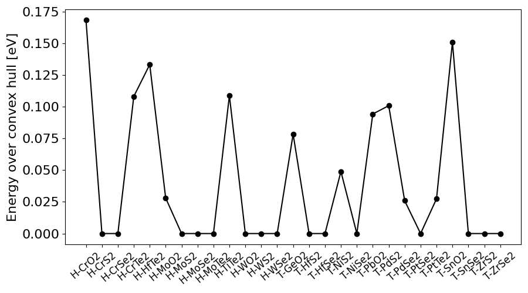
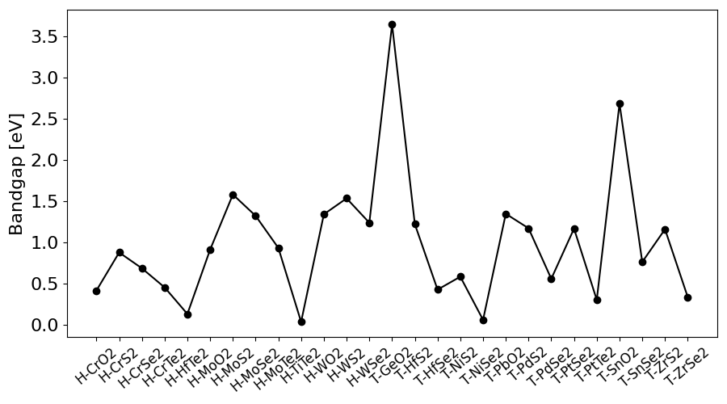
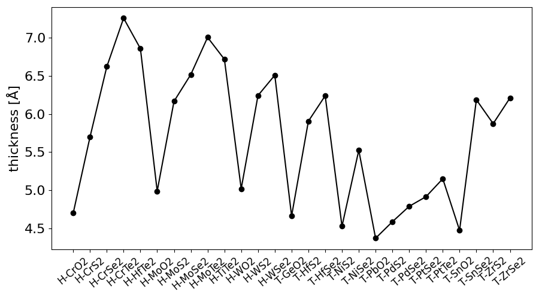
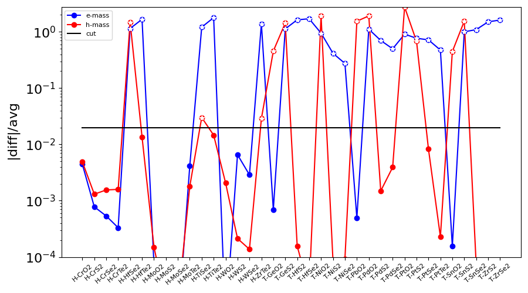
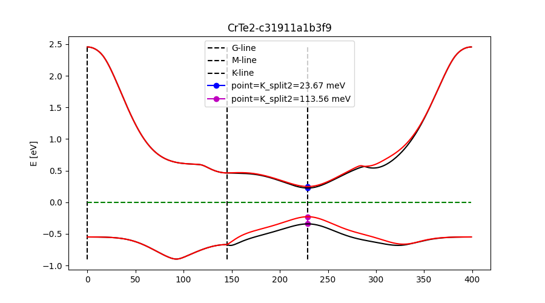

# Selection of materials

This folder contains the scripts for selecting materials to be included in the study. The documentation here should give an overview of the selection process.

The scripts in the folder are meant to be run in succesion. The final scripts copies the file `02_materials_iso_stable.npz` to the path `02-qeh-calculations/materials_iso_stable.npz` where the next part of the workflow takes place, namely the ab initio calculations using the QEH Model. Also it copies `03_so_split_extremum_loc.npz` to the path `03/-gap-equation/so_split_extremum_loc.npz`, since this file is needed for the gap equation calculations.

We initially consider 51 candidates: these are the transition metal dichalcogenides and oxides, which are in the 2D database [provided by Latini et al](https://cmr.fysik.dtu.dk/vdwh/vdwh.html).

## 1. Check for thermodynamically stable materials (file: `01-get_material_stab.py`)
We first select for stable materials. This is done in `01-get_material_stab.py`.

We require the highest thermodynamic stability level, the highest dynamic stability phonons, the highest dynamic stability for stiffness, and that the material is a first-class material. It may only have been nec-essary to require highest thermodynamic stability level, since this appears to imply that the other crite-rions are met as well, but to be on the safe side, we require all these criteria to be met.

The thermodynamic stability level is related to the energy over convex hull, i.e., the difference in energy of a given crystal structure for a given formula compared to the most stable structure for that formula. For high stability level the energy over convex hull is below 0.2 eV, as illustrated below.

</img>

In addition, we require that there actually is a bandgap (T-PdTe2 has no bandgap (only instance)). Finally, we check that the bandgap does not exceed the bandgap of hex-BN, 4.67 eV (otherwise this can-not be used as a barrier). On the figure below, we show that for the materials that meet our final selec-tion criteria none of them has a bandgap exceeding 4.67 eV, and all is good.

</img>

**The selection in get_material_stab.py for stable materials leaves us with 36 candidates.**

## 2. Isotropicity and thicknesses (files: `02a_load_uid_file.py` and `02b_get_eff_masses_materials_stable.py`)
**2.a Calculate Layer Thicknesses**

For our simulations we need the thicknesses of the sandwiched structure. These are taken from simulations performed by coauthor Sahar Pakdel for a bilayer-structure with the same material and no barrier. `02a_load_uid_file.py` writes the unique ID’s (uid), which is used in c2db to identify materials to a text file (`02a_uid_for_which_we_need_a_thickness.txt`), which we give to Pakdel.

Pakdel in turn gives us a text-file `02a_thicknesses.txt` with thicknesses. The thicknesses are extracted and saved to the npz-file (`02_materials_iso_stable.npz`) along with the all the other information in `02b_get_eff_masses_materials_stable.py`. The thicknesses are plotted below.

</img>

We observe that the oxides are generally the materials with the smallest thickness.

**2.b Check for Isotropicity**

Next we require the material to be isotropic, since this is assumed in the QEH-framework. For this we consider the effective masses in two different directions around the band-extremum. We require that the difference between the mass in each direction is within 2% of their average. The selection is done in `02b-get_eff_masses_materials_stable.py`. 

</img>

The selection is illustrated in the above figure, where the difference in effective masses divided by the average has been plotted on a logarithmic axis. Blue is for the conduction band and red is for the valence band  The materials deemed non-isotropic are marked with a white star. We observe two materials that we could have included with a slightly less restrictive isotropy-criterion, but we have enough materials already. We are left with 27 materials: 24 of these can be used as p-doped material (i.e. isotropic in the valence band) and 14 can be used as n-doped material.

This concludes the selection process.

**Remark:** the prefix T- and H- refers to the symmetry group of a TMD. For the oxides (TMOs), this distinction is not adopted in the c2db. However, the T- and H- for the TMD translate to certain crystal types, and these are the crystal that we refer to when we use T- and H- for the oxides.

## 3. Spin-orbit Coupling
When solving the gap-equation we need the spin-orbit splitting.
For this, we first download json for the materials. This is done in `03a_get_jsonfiles.py` and the files are saved in the jsonfiles-folder.
In `03b_get_bands.py` we read the json-files and save the spin-orbit splitting and the extremum k-space location (i.e. name of high symmetry point) for each material in `03_so_split_extremum-loc.npz` (*Note: The format of the online json-files might have changed since this documentation was written, but the script works with the currently downloaded json-files included in this folder.*). The relevant lists are:
```
split2_val_vec
split2_cond_vec
loc_val_vec
loc_cond_vec
```
Also, we plot the spin-orbit splitted valence and conduction bands for each material, where the relevant extrema and so-splits are marked. These are saved under `./plots` with the materials uid as file-name. An example is seen below. (The x-axis is just the indexing of k-points).

</img>

**Display Bands**

In `03c_display_band-data.py` we plot the bandgap and the so-splitting for the conduction and valence band. The two last figures are shown below:

</img>

The figures also contain information on the location of the extremum. Generally, there is no so-splitting at the Gamma-point (G), while there is always a non-zero splitting at the K-point.
I note that I have checked that the splitting is in accordance with the splitting reported in the [Conti superfluidity paper](https://doi.org/10.3390/condmat5010022) for the 4 materials MoS2, MoSe2, WS2, and WSe2.

## 4. Prepare for QEH Calculations
In this final script we simply copy the file `02_materials_iso_stable.npz` to the directory `02-qeh-calculations` where the next part of the workflow takes place, anemly the ab initio calculations using the QEH Model. Also we copy `03_so_split_extremum_loc.npz` to the path `03/-gap-equation/so_split_extremum_loc.npz`, since this file is needed for the gap equation calculations.

## Further comments on a few codes
`01_get_materials_stab.py` just takes all the `*-chi.npz` files from the current folder as input, so if one will consider more building blocks this can simply be done by adding their building block file to this folder.

`02_get_eff_masses_materials_stable.py` takes as input the `01_materials_stable.npz`-file generated by `01_get_materials_stab.py`. It plots some stuff and saves the final materials selected and their properties in `02_materials_iso_stable.npz`. This is the file that we use for the exciton binding energy analysis.

